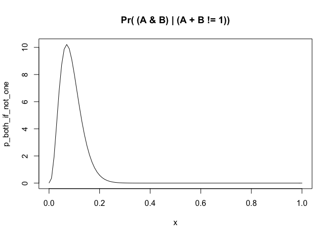
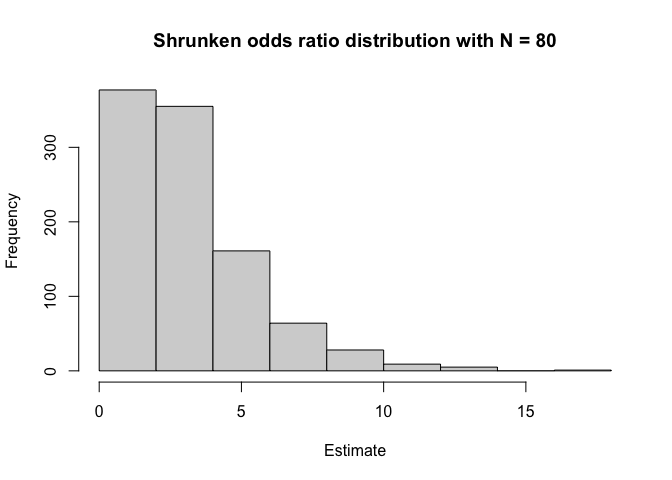

# Summary
_This Rmd is an edited version of Tim's code; with my fun novice-like substitutions._
I chose the data set from a Genentech study [Seshagiri et al, Nature, 2012](https://www.nature.com/articles/nature11282#Sec1) about Colorectal Adenocarcinomas (n=74). This study's main finding was that _RSPO_ (R-spondin) fusions were mutually exclusive with _APC_ mutations, indicating the former's role in Wnt signaling. The authors validated the biological activity of the R-spondin fusions using a Wnt-responsive luciferase reporter, TOPbrite.
. 


With that in mind, I initially sought to explore the question: Does the mutual exclusivity of _APC_ mutations and _RSPO_ fusions hold up in larger sample sizes, and how can we test the statistical power of this study and a study with a larger cohort? 

**BUT**

There is no fusion data for this study in cBioPortal. So I chose the next best thing that was also highlighted in this study: _TCF7L2_. This gene was implicated in Wnt signaling and I wanted to see if it would exhibit mutational mutual exclusivity from other genes involved in this pathway. My rationale was that _RSPO_ fusions, _APC_, and _CTNNB1_, all involved in the Wnt pathway, seem to exhibit some form of mutational mutual exclusivity. My question: Would _TCF7L2_ be the same?

# Let's Dig In

## Setup


## Fetching Colorectal Adenocarcinoma studies 

Let's fetch only studies that involve Colorectal Adenocarcinoma.


```r
mycgds <- CGDS("http://www.cbioportal.org/")
getCancerStudies(mycgds) %>% 
  filter(str_detect(name, "Colorectal Adenocarcinoma")) %>% 
  select(cancer_study_id, name) %>% 
  kbl() %>% 
  kable_styling(bootstrap_options = c("striped", "hover"))
```

<table class="table table-striped table-hover" style="margin-left: auto; margin-right: auto;">
 <thead>
  <tr>
   <th style="text-align:left;"> cancer_study_id </th>
   <th style="text-align:left;"> name </th>
  </tr>
 </thead>
<tbody>
  <tr>
   <td style="text-align:left;"> coadread_dfci_2016 </td>
   <td style="text-align:left;"> Colorectal Adenocarcinoma (DFCI, Cell Reports 2016) </td>
  </tr>
  <tr>
   <td style="text-align:left;"> coadread_genentech </td>
   <td style="text-align:left;"> Colorectal Adenocarcinoma (Genentech, Nature 2012) </td>
  </tr>
  <tr>
   <td style="text-align:left;"> coadread_tcga </td>
   <td style="text-align:left;"> Colorectal Adenocarcinoma (TCGA, Firehose Legacy) </td>
  </tr>
  <tr>
   <td style="text-align:left;"> coadread_tcga_pub </td>
   <td style="text-align:left;"> Colorectal Adenocarcinoma (TCGA, Nature 2012) </td>
  </tr>
  <tr>
   <td style="text-align:left;"> coadread_tcga_pan_can_atlas_2018 </td>
   <td style="text-align:left;"> Colorectal Adenocarcinoma (TCGA, PanCancer Atlas) </td>
  </tr>
  <tr>
   <td style="text-align:left;"> coadread_mskcc </td>
   <td style="text-align:left;"> Colorectal Adenocarcinoma Triplets (MSKCC, Genome Biol 2014) </td>
  </tr>
</tbody>
</table>

Let's find out how many samples are in each study and order the studies from smallest to largest.

This didn't quite work for the TCGA study but we can always go to the website to check how many samples were in this study (PS: we did this later, just keep scrolling).


```r
getCancerStudies(mycgds) %>% 
  filter(str_detect(name, "Colorectal Adenocarcinoma")) %>% 
  mutate(n = as.integer(str_extract(description, "[0-9]+"))) %>% 
  select(cancer_study_id, n, name) %>% 
  arrange(n) %>% 
  kbl() %>% 
  kable_styling(bootstrap_options = c("striped", "hover"))
```

<table class="table table-striped table-hover" style="margin-left: auto; margin-right: auto;">
 <thead>
  <tr>
   <th style="text-align:left;"> cancer_study_id </th>
   <th style="text-align:right;"> n </th>
   <th style="text-align:left;"> name </th>
  </tr>
 </thead>
<tbody>
  <tr>
   <td style="text-align:left;"> coadread_tcga_pan_can_atlas_2018 </td>
   <td style="text-align:right;"> 3 </td>
   <td style="text-align:left;"> Colorectal Adenocarcinoma (TCGA, PanCancer Atlas) </td>
  </tr>
  <tr>
   <td style="text-align:left;"> coadread_mskcc </td>
   <td style="text-align:right;"> 69 </td>
   <td style="text-align:left;"> Colorectal Adenocarcinoma Triplets (MSKCC, Genome Biol 2014) </td>
  </tr>
  <tr>
   <td style="text-align:left;"> coadread_genentech </td>
   <td style="text-align:right;"> 74 </td>
   <td style="text-align:left;"> Colorectal Adenocarcinoma (Genentech, Nature 2012) </td>
  </tr>
  <tr>
   <td style="text-align:left;"> coadread_tcga_pub </td>
   <td style="text-align:right;"> 224 </td>
   <td style="text-align:left;"> Colorectal Adenocarcinoma (TCGA, Nature 2012) </td>
  </tr>
  <tr>
   <td style="text-align:left;"> coadread_dfci_2016 </td>
   <td style="text-align:right;"> 619 </td>
   <td style="text-align:left;"> Colorectal Adenocarcinoma (DFCI, Cell Reports 2016) </td>
  </tr>
  <tr>
   <td style="text-align:left;"> coadread_tcga </td>
   <td style="text-align:right;"> 2016 </td>
   <td style="text-align:left;"> Colorectal Adenocarcinoma (TCGA, Firehose Legacy) </td>
  </tr>
</tbody>
</table>

Okay! So we have a few to choose from here. The Genentech one looks interesting and has a paper to go along with it (checked cBioPortal for this). We'll start with this "small-sized" cohort and then compare our findings with the larger-sample-size TCGA cohort, but let's not get ahead of ourselves.

## Fetching case lists to collate mutations and other aberrations 

Let's start with the Genentech study and its 74 subjects. `getCaseLists(CGDS, cancerStudy)` does that:


```r
coadread_study <- "coadread_genentech" # this is the cancer_study_id from the tables above

# the IDs of the cases in the GEN CAD study
getCaseLists(mycgds, cancerStudy=coadread_study) %>% 
  filter(case_list_name == "Samples with mutation data") ->
  coadread_caselists


# grab the list of lesions
getGeneticProfiles(mycgds, coadread_study) %>% 
  filter(genetic_profile_name == "Mutations") %>% 
  pull(genetic_profile_id) ->
    coadread_mutations_profile

# a few "greatest hits" mutations seen in COADREAD
coadread_genes <- c("APC", "TCF7L2", "CTNNB1") # I tried a few different genes before I settled on these - will share in the summary section at the end. But for fun, see what I tested out first:
  #"TP53", "KRAS", "ATM", "CTNNB1", "KRAS", "RSPO","PIK3CA", "PTEN", "TP53", "SMAD4", "FBXW7", "ATM",     "BRAF", "TET", "ERBB", "EIF3E")

# get the mutations data and tidy it up
get_muts <- function(x, genes, ...) {
  
  muts <- getProfileData(x, genes, ...)
  is.na(muts) <- (muts == "NaN")
  muts[is.na(muts)] <- 0
  muts[muts != 0] <- 1  
  rn <- rownames(muts)
  muts <- data.frame(lapply(muts, as.integer))
  rownames(muts) <- rn
  return(muts[, genes])
  
}

# We throw out the nature of the mutation here, which is rarely a wise idea (if ever)
muts <- get_muts(mycgds, 
                 coadread_genes, 
                 geneticProfiles=coadread_mutations_profile, 
                 caseList=coadread_caselists$case_list_id)

muts %>% 
  filter(rowSums(.) > 0) %>%
  t() %>%
  kbl() %>% 
  kable_styling(bootstrap_options = c("striped", "hover"))
```

<table class="table table-striped table-hover" style="margin-left: auto; margin-right: auto;">
 <thead>
  <tr>
   <th style="text-align:left;">   </th>
   <th style="text-align:right;"> X587220 </th>
   <th style="text-align:right;"> X587222 </th>
   <th style="text-align:right;"> X587224 </th>
   <th style="text-align:right;"> X587228 </th>
   <th style="text-align:right;"> X587230 </th>
   <th style="text-align:right;"> X587238 </th>
   <th style="text-align:right;"> X587248 </th>
   <th style="text-align:right;"> X587256 </th>
   <th style="text-align:right;"> X587260 </th>
   <th style="text-align:right;"> X587278 </th>
   <th style="text-align:right;"> X587284 </th>
   <th style="text-align:right;"> X587292 </th>
   <th style="text-align:right;"> X587294 </th>
   <th style="text-align:right;"> X587300 </th>
   <th style="text-align:right;"> X587306 </th>
   <th style="text-align:right;"> X587316 </th>
   <th style="text-align:right;"> X587322 </th>
   <th style="text-align:right;"> X587328 </th>
   <th style="text-align:right;"> X587330 </th>
   <th style="text-align:right;"> X587336 </th>
   <th style="text-align:right;"> X587338 </th>
   <th style="text-align:right;"> X587340 </th>
   <th style="text-align:right;"> X587350 </th>
   <th style="text-align:right;"> X587352 </th>
   <th style="text-align:right;"> X587356 </th>
   <th style="text-align:right;"> X587360 </th>
   <th style="text-align:right;"> X587364 </th>
   <th style="text-align:right;"> X587370 </th>
   <th style="text-align:right;"> X587376 </th>
   <th style="text-align:right;"> X587378 </th>
   <th style="text-align:right;"> X587380 </th>
   <th style="text-align:right;"> X587384 </th>
   <th style="text-align:right;"> X587386 </th>
   <th style="text-align:right;"> X587388 </th>
   <th style="text-align:right;"> X587398 </th>
  </tr>
 </thead>
<tbody>
  <tr>
   <td style="text-align:left;"> APC </td>
   <td style="text-align:right;"> 1 </td>
   <td style="text-align:right;"> 1 </td>
   <td style="text-align:right;"> 1 </td>
   <td style="text-align:right;"> 1 </td>
   <td style="text-align:right;"> 1 </td>
   <td style="text-align:right;"> 1 </td>
   <td style="text-align:right;"> 1 </td>
   <td style="text-align:right;"> 0 </td>
   <td style="text-align:right;"> 1 </td>
   <td style="text-align:right;"> 1 </td>
   <td style="text-align:right;"> 1 </td>
   <td style="text-align:right;"> 1 </td>
   <td style="text-align:right;"> 1 </td>
   <td style="text-align:right;"> 0 </td>
   <td style="text-align:right;"> 1 </td>
   <td style="text-align:right;"> 0 </td>
   <td style="text-align:right;"> 1 </td>
   <td style="text-align:right;"> 1 </td>
   <td style="text-align:right;"> 1 </td>
   <td style="text-align:right;"> 0 </td>
   <td style="text-align:right;"> 0 </td>
   <td style="text-align:right;"> 1 </td>
   <td style="text-align:right;"> 1 </td>
   <td style="text-align:right;"> 1 </td>
   <td style="text-align:right;"> 1 </td>
   <td style="text-align:right;"> 1 </td>
   <td style="text-align:right;"> 1 </td>
   <td style="text-align:right;"> 0 </td>
   <td style="text-align:right;"> 1 </td>
   <td style="text-align:right;"> 1 </td>
   <td style="text-align:right;"> 1 </td>
   <td style="text-align:right;"> 1 </td>
   <td style="text-align:right;"> 1 </td>
   <td style="text-align:right;"> 1 </td>
   <td style="text-align:right;"> 1 </td>
  </tr>
  <tr>
   <td style="text-align:left;"> TCF7L2 </td>
   <td style="text-align:right;"> 0 </td>
   <td style="text-align:right;"> 1 </td>
   <td style="text-align:right;"> 0 </td>
   <td style="text-align:right;"> 0 </td>
   <td style="text-align:right;"> 0 </td>
   <td style="text-align:right;"> 0 </td>
   <td style="text-align:right;"> 0 </td>
   <td style="text-align:right;"> 0 </td>
   <td style="text-align:right;"> 0 </td>
   <td style="text-align:right;"> 0 </td>
   <td style="text-align:right;"> 0 </td>
   <td style="text-align:right;"> 1 </td>
   <td style="text-align:right;"> 0 </td>
   <td style="text-align:right;"> 1 </td>
   <td style="text-align:right;"> 0 </td>
   <td style="text-align:right;"> 0 </td>
   <td style="text-align:right;"> 1 </td>
   <td style="text-align:right;"> 0 </td>
   <td style="text-align:right;"> 0 </td>
   <td style="text-align:right;"> 0 </td>
   <td style="text-align:right;"> 0 </td>
   <td style="text-align:right;"> 0 </td>
   <td style="text-align:right;"> 0 </td>
   <td style="text-align:right;"> 0 </td>
   <td style="text-align:right;"> 0 </td>
   <td style="text-align:right;"> 0 </td>
   <td style="text-align:right;"> 0 </td>
   <td style="text-align:right;"> 1 </td>
   <td style="text-align:right;"> 1 </td>
   <td style="text-align:right;"> 0 </td>
   <td style="text-align:right;"> 0 </td>
   <td style="text-align:right;"> 0 </td>
   <td style="text-align:right;"> 0 </td>
   <td style="text-align:right;"> 0 </td>
   <td style="text-align:right;"> 0 </td>
  </tr>
  <tr>
   <td style="text-align:left;"> CTNNB1 </td>
   <td style="text-align:right;"> 0 </td>
   <td style="text-align:right;"> 0 </td>
   <td style="text-align:right;"> 0 </td>
   <td style="text-align:right;"> 0 </td>
   <td style="text-align:right;"> 0 </td>
   <td style="text-align:right;"> 0 </td>
   <td style="text-align:right;"> 0 </td>
   <td style="text-align:right;"> 1 </td>
   <td style="text-align:right;"> 0 </td>
   <td style="text-align:right;"> 0 </td>
   <td style="text-align:right;"> 0 </td>
   <td style="text-align:right;"> 0 </td>
   <td style="text-align:right;"> 0 </td>
   <td style="text-align:right;"> 0 </td>
   <td style="text-align:right;"> 0 </td>
   <td style="text-align:right;"> 1 </td>
   <td style="text-align:right;"> 0 </td>
   <td style="text-align:right;"> 0 </td>
   <td style="text-align:right;"> 0 </td>
   <td style="text-align:right;"> 1 </td>
   <td style="text-align:right;"> 1 </td>
   <td style="text-align:right;"> 0 </td>
   <td style="text-align:right;"> 0 </td>
   <td style="text-align:right;"> 0 </td>
   <td style="text-align:right;"> 0 </td>
   <td style="text-align:right;"> 0 </td>
   <td style="text-align:right;"> 0 </td>
   <td style="text-align:right;"> 0 </td>
   <td style="text-align:right;"> 1 </td>
   <td style="text-align:right;"> 0 </td>
   <td style="text-align:right;"> 0 </td>
   <td style="text-align:right;"> 0 </td>
   <td style="text-align:right;"> 0 </td>
   <td style="text-align:right;"> 0 </td>
   <td style="text-align:right;"> 0 </td>
  </tr>
</tbody>
</table>

What a nice table! I think visualizing this as a heatmap would be better, so let's do that!

## Plotting (some of) the results from our query
You can also embed plots, for example a sort-of-oncoprint of this study:

<!-- -->

Based on this plot, I wanted to see whether _APC_ and _TCF7L2_ are truly co-mutated/co-occur because it's difficult to eye-ball it here. We can test this like how Tim showed us in the [mutual exclusivity study](https://github.com/ttriche/ttriche.github.io/blob/gh-pages/WCSR/extract.md) of IDH1, IDH2, TET2, and WT1:


```r
message("Chi-squared p-value:", appendLF = FALSE)
```

```
## Chi-squared p-value:
```

```r
muts %>% 
  tabyl(APC, TCF7L2) %>% 
  chisq.test(simulate.p.value = TRUE) %>% 
  getElement("p.value")
```

```
## [1] 0.2043978
```

```r
message("Fisher's exact test p-value:", appendLF = FALSE)
```

```
## Fisher's exact test p-value:
```

```r
muts %>% 
  tabyl(APC, TCF7L2) %>% 
  fisher.test(simulate.p.value = TRUE) %>% 
  getElement("p.value")
```

```
## [1] 0.2120156
```
# Power, sample size, and variance

> "More is not better, better is better...but more of the same is often good enough" 
>
> --- Tim Triche

Our earlier observations of co-operating mutations were _not significant_.
This is a bit hard to eyeball using the heatmap. So, let's try and replicate this result in a bigger study.


```r
tcga <- "coadread_tcga_pan_can_atlas_2018"

getCaseLists(mycgds, tcga) %>% 
  filter(case_list_name == "Samples with mutation data") ->
    tcga_caselists 

# grab the list of lesions
getGeneticProfiles(mycgds, tcga) %>% 
  filter(genetic_profile_name == "Mutations") %>% 
  pull(genetic_profile_id) ->
    tcga_mutations_profile

# grab the mutation matrix for the genes as before
tcga_muts <- get_muts(mycgds,      # as before
                           coadread_genes,   # as before 
                           tcga_mutations_profile, 
                           tcga_caselists$case_list_id)

# out of curiosity, how many of each mutation do we see here? 
colSums(tcga_muts)
```

```
##    APC TCF7L2 CTNNB1 
##    387     62     33
```

Looks like we're all set to replicate our previous results.


```r
message("Chi-squared p-value (Northcott):", appendLF = FALSE)
```

```
## Chi-squared p-value (Northcott):
```

```r
tcga_muts %>% 
  tabyl(APC, TCF7L2) %>% 
  chisq.test(simulate.p.value = TRUE) %>% 
  getElement("p.value")
```

```
## [1] 0.01349325
```

```r
message("Fisher's exact test p-value (Northcott):", appendLF = FALSE)
```

```
## Fisher's exact test p-value (Northcott):
```

```r
tcga_muts %>% 
  tabyl(APC, TCF7L2) %>% 
  fisher.test(simulate.p.value = TRUE) %>% 
  getElement("p.value")
```

```
## [1] 0.01506065
```

How interesting! Here, it looks like our p-values _are_ significant. It seems that _APC_ and _TCF7L2_ do occur together. How about we plot this to see how it looks with this data set!


```r
# let's use pheatmap again
pheatmap(t(data.matrix(tcga_muts)), 
         col=c("white", "darkred"), 
         cluster_rows=FALSE,
         clustering_distance_cols="manhattan", 
         clustering_method="ward.D2", 
         legend=FALSE)
```

<!-- -->

```r
# the sample names are just contributing to the noise in this graph. For presentation purposes, let's exclude them:
pheatmap(t(data.matrix(tcga_muts)), 
         col=c("white", "darkred"), 
         cluster_rows=FALSE,
         clustering_distance_cols="manhattan", 
         clustering_method="ward.D2", 
         legend=FALSE,
         show_colnames = FALSE)
```

<!-- -->

Hmm, I ran this but didn't really get results for intersecting data. As such, I'll proceed with the assumption that none of the samples intersected. 

<details>
  <summary>Double Dipping? Maybe Not</summary>

```r
tcga_caselists %>% 
  pull(case_ids) %>% 
  str_split(pattern=" ") %>% 
  getElement(1) -> 
    tcga_cases

coadread_caselists %>%
  pull(case_ids) %>% 
  str_split(pattern=" ") %>% 
  getElement(1) ->
    coadread_cases

intersect(tcga_cases, coadread_cases)
```

```
## [1] ""
```

```r
# this section for dropping cases ran into an error as well. I will gladly step over this unknown and ask about it during my presentation

# tcga_only <- setdiff(tcga_cases, coadread_cases)

# tcga_muts <- get_muts(mycgds,      # as before
                     # coadread_genes,   # as before 
                     # geneticProfiles=tcga_mutations_profile,
                     # cases=tcga_only)
```
</details>

Now we are looking for the odds ratio - this quantifies the strength of an association between two events. In this case, the co-occurrence of _APC_ and _TCF7L2_ mutations. 
  OR = 1 means the events are independent
  OR > 1 means the events are positively correlated 
  OR < 1 means the events are negatively correlated


```r
muts %>% 
  tabyl(APC, TCF7L2) %>% 
  fisher.test() %>% 
  getElement("estimate") -> 
    coadread_estimate

tcga_muts %>% 
  tabyl(APC, TCF7L2) %>% 
  fisher.test() %>% 
  getElement("estimate") ->
    tcga_estimate

message("Co-occurrence odds ratio (CoadRead cases): ", round(coadread_estimate, 3))
```

```
## Co-occurrence odds ratio (CoadRead cases): 3.225
```

```r
message("Co-occurrence odds ratio (TCGA cases): ", round(tcga_estimate, 3))
```

```
## Co-occurrence odds ratio (TCGA cases): 2.43
```

```r
message("Effect size inflation, CoadRead vs. TCGA: ",
        round(coadread_estimate / tcga_estimate), "x")
```

```
## Effect size inflation, CoadRead vs. TCGA: 1x
```

The estimate from the Seshagiri(CoadRead) study is **one times** as large as from TCGAs. 
I suppose this is a slight over-estimation of the results??

# Simulations, power, and reducing the variance of estimates 

Let's make this concrete with some simulations.  We'll adjust the effect size 
slightly for co-mutations of _APC_ and _TCF7L2_ in colorectal adenocarcinomas, then run
some simulations at various sample sizes to see what we see. (You can also use
an analytical estimate via `power.prop.test` and similar, but for better or worse,
simulating from a noisy generating process is about the same amount of work for 
powering Fisher's test, as is the case for many tests of significance, as in trials.)

In order to take into account uncertainty (proposing that we found what we found
in the original Seshagiri study and wanted to estimate the odds of seeing it again), 
we'll use the [beta distribution](http://varianceexplained.org/statistics/beta_distribution_and_baseball/) to capture a "noisy" estimate of a proportion.  Specifically, let's
use the original mutation table to estimate each from the Seshagiri data. 


```r
neither <- nrow(subset(muts, APC == 0 & TCF7L2 == 0))
APC <- nrow(subset(muts, APC == 1 & TCF7L2 == 0))
TCF7L2 <- nrow(subset(muts, APC == 0 & TCF7L2 == 1))
both <- nrow(subset(muts, APC == 1 & TCF7L2 == 1))
```

Now we have all we really need to simulate. Formally, we will model it like so.

* For each sample, we simulate the occurrence of _one_ mutation.
* If a sample has _one_ mutation, we simulate which one (APC or TCF7L2).
* If a sample has fewer or more than _one_ mutation, we simulate which.

We can do this repeatedly to estimate the distribution of test
statistics to expect if we run this experiment quite a few times,
with both smaller and larger total sample sizes. We're assuming that
the dependency structure is fairly stable (is this reasonable?). 

The `Beta(a, b)` distribution above is continuous between 0 and 1, and its shape depends
on the values of `a` and `b`. For example, we can plot each of the above using the 
Seshagiri-derived values to get a feel for how "mushy" our guesses are given
the number of samples in the Genentech study. Effectively, we propagate our 
underlying uncertainty about parameters by drawing them from a sensible generator,
and that sensible generator is a beta distribution reflecting our sample size. 


```r
a <- APC
b <- TCF7L2 

p_one <- function(x) dbeta(x, (a + b), (both + neither))
p_both <- function(x) dbeta(x, both, (a + b + neither))
p_both_if_not_one <- function(x) dbeta(x,  both, neither)

plot(p_one, main="Pr(A|B & !(A & B))")
```

<!-- -->

```r
plot(p_both, main="Pr(A & B)")
```

<!-- -->

```r
plot(p_both_if_not_one, main="Pr( (A & B) | (A + B != 1))")
```

<!-- -->

Now for `n` samples, we can simulate appropriately "noisy" 2x2 tables with that many subjects.


```r
sim2x2 <- function(n, neither, a, b, both) {

  p_one <- rbeta(1, (a + b), (both + neither))
  p_both <- rbeta(1, both, neither)
  p_a <- rbeta(1, a, b)
  
  n_a_b <- rbinom(1, n, p_one)
  n_neither_both <- n - n_a_b
  n_both <- rbinom(1, n_neither_both, p_both)
  n_neither <- n_neither_both - n_both
  n_a <- rbinom(1, n_a_b, p_a)
  n_b <- n_a_b - n_a

  as.table(matrix(c(n_neither, n_a, n_b, n_both), nrow=2))
  
}
```

Let's give it a shot.


```r
a <- APC
b <- TCF7L2 

sim2x2(n=nrow(muts), neither, a, b, both)
```

```
##    A  B
## A 37  6
## B 22  7
```

That seems to work fine. Let's find analytic estimate for an asymptotic test (`prop.test`):


```r
# fairly generic 
simFisher <- function(n, neither, a, b, both) fisher.test(sim2x2(n, neither, a, b, both))

# using the values we've already set up to simulate from: 
simFetP <- function(n) simFisher(n, neither, a, b, both)$p.value
```

The `replicate` function is quite helpful here. Let's suppose the Seshagiri 
study is representative of CoadRead generally. We'll simulate 1000 
studies of sizes between 10 and 800 to see how often our (true!) difference
in proportions registers as significant at p < 0.05. 


```r
powerN <- function(n, alpha=0.05) {
  res <- table(replicate(1000, simFetP(n=n)) < alpha)
  res["TRUE"] / sum(res)
}

for (N in c(10, 40, 80, 100, 300, 500, 800)) {
  message("Power at alpha = 0.05 with n = ", N, ": ", powerN(N) * 100, "%")
}
```

```
## Power at alpha = 0.05 with n = 10: 0.5%
```

```
## Power at alpha = 0.05 with n = 40: 14.4%
```

```
## Power at alpha = 0.05 with n = 80: 29%
```

```
## Power at alpha = 0.05 with n = 100: 36.9%
```

```
## Power at alpha = 0.05 with n = 300: 64.9%
```

```
## Power at alpha = 0.05 with n = 500: 71.9%
```

```
## Power at alpha = 0.05 with n = 800: 78.7%
```

So what's the estimated power with a sample size of 74? 


```r
   message("Power at alpha = 0.05 with n = ", 74, ": ", powerN(74) * 100, "%")
```

```
## Power at alpha = 0.05 with n = 74: 29.9%
```

Let's add a pseudocount to the shrunken odds ratio estimator to stabilize them.


```r
# how wild are our odds ratios at a given N?
shrinkOR <- function(n, pseudo=2) {
  res <- sim2x2(n, neither, a, b, both) + pseudo
  odds <- (res[1,1] * res[2,2]) / (res[1,2] * res[2,1])
  return(odds)
}

OR0 <- function(n) replicate(1000, shrinkOR(n, pseudo=1e-6))

for (N in c(10, 20, 40, 80)) {
  hist(OR0(n=N), xlab="Estimate", main=paste("Near-raw odds ratio distribution with N =", N))
}
```

<!-- --><!-- --><!-- --><!-- -->

```r
# And if we shrink a bit (i.e., apply a prior)?
ORs <- function(n) replicate(1000, shrinkOR(n))

for (N in c(10, 20, 40, 80)) {
  hist(ORs(n=N), xlab="Estimate", main=paste("Shrunken odds ratio distribution with N =", N))
}
```

<!-- --><!-- --><!-- --><!-- -->

The tails of the estimates are pretty long, but the mass concentrates quickly near the true
parameter estimate. (This is also why resampling approaches can help stabilize estimates:
if you have enough data to estimate a parameter, resampling can also estimate how fragile 
your estimates are, and therefore how trustworthy they are. That's why we bootstrap.) 


# Thoughts and questions

## Introspective moment
The code runs, and my understanding of it all is pretty solid until we get to simulations and power analysis. Can we walk through this in class?

## A few ideas and Questions
I would have liked to compare the mutational data to RSPO fusion data (if this was available). 
- How would I go about this?
- Would I need to do a multiple comparison test at this point for _APC_, _CTNNB1_, _RSPO2_ and _RSPO3_? I started doing this but realized I really did not know how to interpret the results afterwards. I basically copied the code used [here](https://github.com/ttriche/ttriche.github.io/blob/gh-pages/WCSR/extract.md) but was lost after executing it.
- Can we talk about the Odds Ratio section and the Estimates? And how to plot the histograms with logOrs too.

